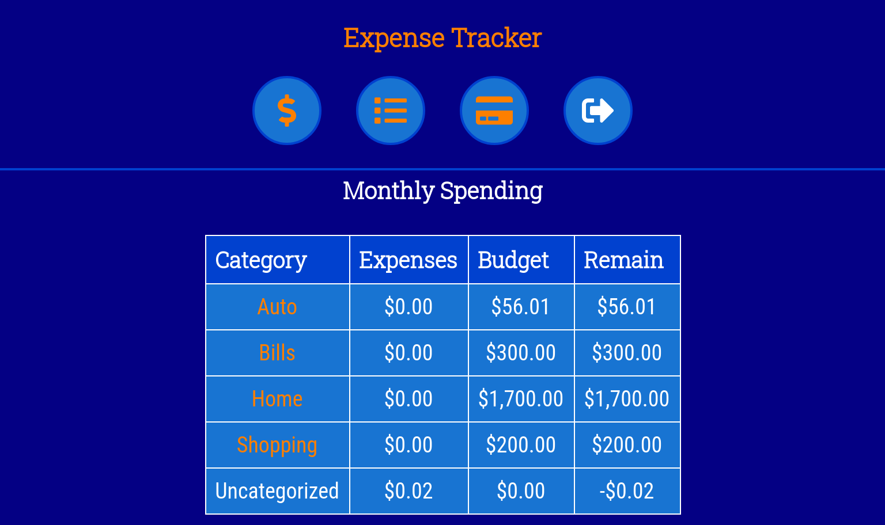

# [Expense Tracker API](https://expense-tracker-cdd.herokuapp.com/)

This is the repo for the backend of [Expense Tracker](https://expense-tracker-client.vercel.app/). Expense Tracker is an easy to use budgeting app that helps one keep track of their expenses and see trends over time. The frontend communicates to the backend using the API:

-   **/api/auth**

    The auth endpoint is used to authenticate users during login. It accepts a POST request with a username and password.

-   **/api/categories, /api/categories/{id}**

    The categories endpoint is used to get information about the budget categories set up by the user. It accepts GET and POST requests to the endpoint and will accept GET, UPDATE, and DELETE requests to the specific id.

-   **/api/payment-methods, /api/payment-methods/{id}**

    The payment methods endpoint is used to get information about the payment methods set up by the user. It accepts GET and POST requests to the endpoint and will accept GET, UPDATE, and DELETE requests to the specific id.

-   **/api/expenses**

    The expenses endpoint is used to get information about the expenses entered by the user. It accepts GET and POST requests to the endpoint and will accept GET, UPDATE, and DELETE requests to the specific id.

-   **/api/users**

    The users endpoint is used to register new users. It accepts a POST request with a username and password.

The API is located [here](https://expense-tracker-cdd.herokuapp.com/).

[Expense Tracker](https://expense-tracker-client.vercel.app/) is built using Node/Express/PostgreSQL for the backend and React for the [frontend](https://github.com/camdecoster/expense-tracker-client). Give it a try and let me know if you have any [feedback or suggestions](https://github.com/camdecoster/expense-tracker-api/issues) on the API.
